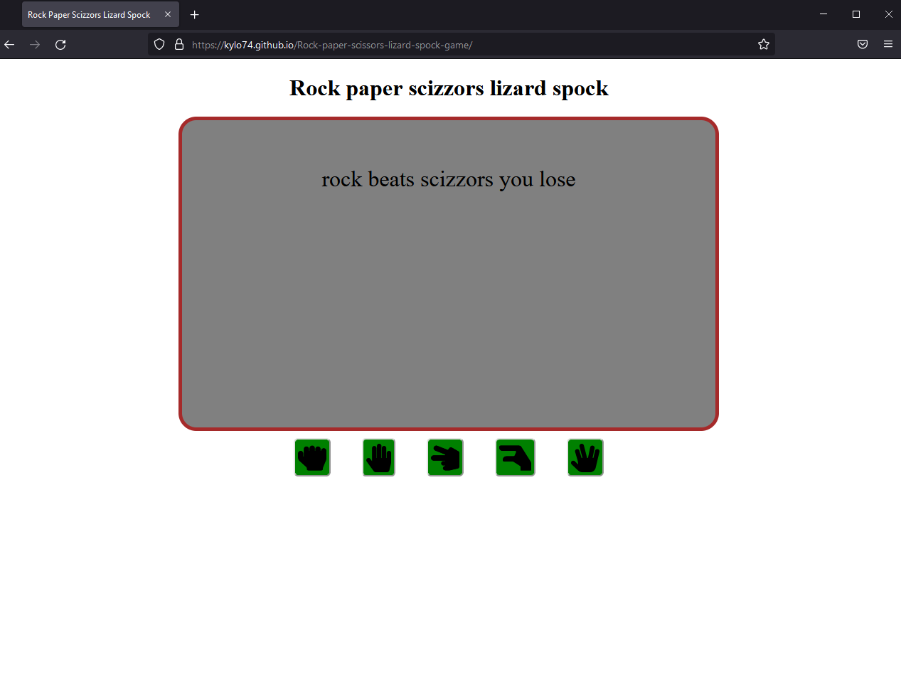

# Rock-paper-scissors-lizard-spock-game

This is a website that was created for someone who is looking for a fun and challenging chance based game.

## Features

### Existing features

- __Title__
    - Tells the user what the game is.

- __Display area__
    - Shows the user the result after they pick an option and what the computer picked.
    - Tells the user who won.
    - If the user has not picked an option there will be a message that asks them to select an option to start playing.

- __Controls__
    - Lets the user interact with the website and play the game.
    - Made using fontawesome icons.
    - Has aria labels to make it more accessible.

### Features left to implement

- __Score tracking__
    - If I had more time I would've added some code that tracked score and a button that resets score to 0 when clicked

## Testing

I have tested and made sure that the website works on the following browsers

Chrome

Firefox

Operagx

Brave

### Validator testing

- HTML
    - I tested the website in the w3c html validator and it returned no errors

- CSS
    - I tested the website in the w3c css validator and it returned no errors

- Javascript
    - I tested the websites javascript using jshint and it returned no errors

- Lighthouse
    - I ran a lighthouse check on the website an it returned suitably high numbers

